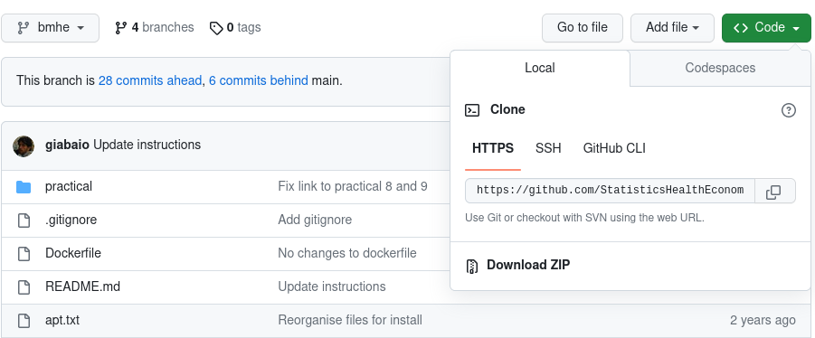

# Short course "Bayesian modelling for economic evaluation of healthcare interventions" - [VIBASS 7](http://vabar.es/events/vibass7/)
## Rstudio environment

This repository contains the set up to create a `Rstudio` environment with all the relevant packages and programmes installed.

This is useful to work on the practicals. You may want to also install the full configuration on your local machine, but this is useful if, for example, you don't have full write access to your machine or don't have a fully working `R` installation.

## Using docker locally

[Binder](https://mybinder.org/) is basically just a front-end to run a [docker container](https://www.docker.com/resources/what-container/) remotely. You can also install docker locally, which means that you can run a virtual machine (much as you do by running Binder, as per the instructions above). [Here](https://docs.docker.com/desktop/) you can find some instructions on installing and running a local instance of docker. 

Once you have done this, you can run the docker virtul machine **locally**, which means that you don't need to install `R` or `JAGS` on your machine, but rather use the container to do the practicals. To do this, you will still need to install locally this GitHub repository (see details below).

## Local installation

Alternatively, you can use this repository onto your computer and use it locally. There are various ways in which you can do so.

### Download the content to your computer

If you are not familiar with GitHub, your best option is probably to simply download the content of this repository. 

- Click on green button labelled as `<> Code` in the top-right corner and then click on `Download zip`, as shown in the picture below.

- Once the download is complete, unzip the folder.

### Clone the repository

If, on the other hand you are familiar with GitHub or want to learn how to use it and take full advantage of its version control capabilities, you can "clone" the repository on your computer. This means that you create a local copy that you can keep synchronised with the remote, using GitHub.

- Click on green button labelled as `<> Code` in the top-right corner and then copy the clone link `https://github.com/giabaio/vibass.git`.

- Follow the instructions [here](https://docs.github.com/en/repositories/creating-and-managing-repositories/cloning-a-repository) to clone the repository.

### Using the local installation

Whichever method you have used to install the repository locally, you will end up with a copy of all the contents on your machine. To be able to do the practicals **locally** you will also need to install the following programmes:

- [Rstudio](https://posit.co/download/rstudio-desktop/)

- [OpenBUGS](https://www.mrc-bsu.cam.ac.uk/software/bugs/openbugs/) and [JAGS](https://sourceforge.net/projects/mcmc-jags/files/JAGS/4.x/). 

- A set of relevant `R` packages. Open the file [install.R](install.R) and run the commands listed there in a `Rstudio` session. 

Once you have completed these steps, you can open the "R project" file [practical.Rproj](practical/practical.Rproj) and then run the practicals.
